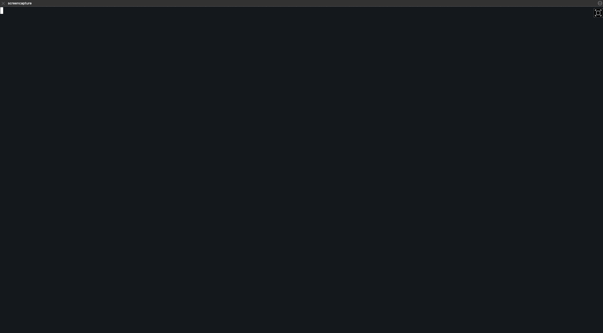

This is a solitaire game that can be played in the terminal.

Currently the game is played using a mouse, there may be plans in the future to
allow the game(s) to be played using the keyboard only.

# Play.
Different variants have different rules of play, however in terms of the UI, the
player clicks on one component (Stock, Waste, Foundation, or Tableau) which will
change colour. The player then clicks on another component (or the same again)
to indicate where the cards will go.

If the move is allowed then the card(s) will move from the first component to
the second.

Movement of card(s) is greedy, that is, if multiple cards can be moved
(generally only from one tableau to another) then the maximum number of cards
that can be moved will be moved.

Happy Playing.



# Build.
Clone the source locally, and run:
```
$ go build cmd/main.go -o irateOils
```

# Installation.
Until builds are created then build the project using the above instructions,
and then move the resulting binary to somewhere on your $PATH.

# Variants.
At this point in time only Klondike is implemented, but the intention is to have
other variants available - please feel free to use the Klondike.go example in
games/ to create your own version.

## Possible Variants [Source](https://en.wikipedia.org/wiki/List_of_patience_games)
### A
- [ ] [Accordion](https://en.wikipedia.org/wiki/Accordion_(solitaire))
- [ ] [Aces and Kings](https://en.wikipedia.org/wiki/Aces_and_Kings)
- [ ] [Aces Square](https://en.wikipedia.org/wiki/Aces_Square_(solitaire))
- [ ] [Aces Up](https://en.wikipedia.org/wiki/Aces_Up)
- [ ] [Acme](https://en.wikipedia.org/wiki/Acme_(solitaire))
- [ ] [Addiction](https://en.wikipedia.org/wiki/Addiction_(solitaire))
- [ ] [Agnes](https://en.wikipedia.org/wiki/Agnes_(card_game))
- [ ] [Alaska](https://en.wikipedia.org/wiki/Alaska_(solitaire))
- [ ] [Algerian](https://en.wikipedia.org/wiki/Algerian_(solitaire))
- [ ] [Alhambra](https://en.wikipedia.org/wiki/Alhambra_(solitaire))
- [ ] [Amazons](https://en.wikipedia.org/wiki/Amazons_(solitaire))
- [ ] [American Toad](https://en.wikipedia.org/wiki/American_Toad_(solitaire))
- [ ] [Apophis](https://en.wikipedia.org/wiki/Apophis_(solitaire))
- [ ] [Appreciate](https://en.wikipedia.org/wiki/Appreciate_(solitaire))
- [ ] [Acquaintance](https://en.wikipedia.org/wiki/Acquaintance_(solitaire))
- [ ] [Archway](https://en.wikipedia.org/wiki/Archway_(solitaire))
- [ ] [Auld Lang Syne](https://en.wikipedia.org/wiki/Auld_Lang_Syne_(solitaire))
- [ ] [Australian Patience](https://en.wikipedia.org/wiki/Australian_Patience)
### B
- [ ] [Babette](https://en.wikipedia.org/wiki/Babette_(card_game))
- [ ] [Backbone](https://en.wikipedia.org/wiki/Backbone_(solitaire))
- [ ] [Baker's Dozen](https://en.wikipedia.org/wiki/Baker%27s_Dozen_(solitaire))
- [ ] [Baker's Game](https://en.wikipedia.org/wiki/Baker%27s_Game)
- [ ] [Baroness](https://en.wikipedia.org/wiki/Baroness_(solitaire))
- [ ] [Batsford](https://en.wikipedia.org/wiki/Batsford_(solitaire))
- [ ] [Beetle](https://en.wikipedia.org/wiki/Beetle_(solitaire))
- [ ] [Beleaguered Castle](https://en.wikipedia.org/wiki/Beleaguered_Castle)
- [ ] [Belvedere](https://en.wikipedia.org/wiki/Belvedere_(solitaire))
- [ ] [Betsy Ross](https://en.wikipedia.org/wiki/Betsy_Ross_(solitaire))
- [ ] [Big Ben](https://en.wikipedia.org/wiki/Big_Ben_(solitaire))
- [ ] [Big Forty](https://en.wikipedia.org/wiki/Big_Forty_(solitaire))
- [ ] [Big Harp](https://en.wikipedia.org/wiki/Big_Harp_(solitaire))
- [ ] [Birthday](https://en.wikipedia.org/wiki/Birthday_(patience))
- [ ] [Bisley](https://en.wikipedia.org/wiki/Bisley_(solitaire))
- [ ] [Black Hole](https://en.wikipedia.org/wiki/Black_Hole_(solitaire))
- [ ] [Block 10](https://en.wikipedia.org/wiki/Block_10_(solitaire))
- [ ] [Blockade](https://en.wikipedia.org/wiki/Blockade_(solitaire))
- [ ] [Bowling Solitaire](https://en.wikipedia.org/wiki/Bowling_(solitaire))
- [ ] [Box Kite](https://en.wikipedia.org/wiki/Box_Kite_(solitaire))
- [ ] [Braid](https://en.wikipedia.org/wiki/Braid_(solitaire))
- [ ] [Brigade](https://en.wikipedia.org/wiki/Brigade_(solitaire))
- [ ] [Bristol](https://en.wikipedia.org/wiki/Bristol_(solitaire))
- [ ] [British Constitution](https://en.wikipedia.org/wiki/British_Constitution_(solitaire))
- [ ] [British Square](https://en.wikipedia.org/wiki/British_Square_(card_game))
- [ ] [Broken Intervals](https://en.wikipedia.org/wiki/Broken_Intervals)
- [ ] [Busy Aces](https://en.wikipedia.org/wiki/Busy_Aces_(solitaire))
### C
- [ ] [Calculation](https://en.wikipedia.org/wiki/Calculation_(card_game))
- [ ] [Canfield](https://en.wikipedia.org/wiki/Canfield_(solitaire))
- [ ] [Capricieuse](https://en.wikipedia.org/wiki/Capricieuse)
- [ ] [Carpet](https://en.wikipedia.org/wiki/Carpet_(solitaire))
- [ ] [Carthage](https://en.wikipedia.org/wiki/Carthage_(solitaire))
- [ ] [Casket](https://en.wikipedia.org/wiki/Casket_(solitaire))
- [ ] [Castles in Spain](https://en.wikipedia.org/wiki/Castles_in_Spain_(solitaire))
- [ ] [Chameleon](https://en.wikipedia.org/wiki/Canfield_(solitaire)#Variations)
- [ ] [Chessboard](https://en.wikipedia.org/wiki/Chessboard_(solitaire))
- [ ] [Cicely](https://en.wikipedia.org/wiki/Cicely_(solitaire))
- [ ] [Citadel](https://en.wikipedia.org/wiki/Citadel_(solitaire))
- [ ] [Clock Patience](https://en.wikipedia.org/wiki/Clock_Patience)
- [ ] [Colorado](https://en.wikipedia.org/wiki/Colorado_(game))
- [ ] [Colours](https://en.wikipedia.org/wiki/Colours_(solitaire))
- [ ] [Concentration](https://en.wikipedia.org/wiki/Concentration_(card_game))
- [ ] [Congress](https://en.wikipedia.org/wiki/Congress_(solitaire))
- [ ] [Contradance](https://en.wikipedia.org/wiki/Contradance_(solitaire))
- [ ] [Corner Card](https://en.wikipedia.org/wiki/Corner_Card_(solitaire))
- [ ] [Corner Patience](https://en.wikipedia.org/wiki/Corner_Patience_(solitaire))
- [ ] [Corners](https://en.wikipedia.org/wiki/Corners_(patience))
- [ ] [Corona](https://en.wikipedia.org/wiki/Corona_(solitaire))
- [ ] [Constitution](https://en.wikipedia.org/wiki/British_Constitution_(solitaire))
- [ ] [Cotillion](https://en.wikipedia.org/wiki/Contradance_(solitaire))
- [ ] [Crapette+](https://en.wikipedia.org/wiki/Crapette)
- [ ] [Courtyard](https://en.wikipedia.org/wiki/Deuces_(solitaire))
- [ ] [Crazy Quilt](https://en.wikipedia.org/wiki/Crazy_Quilt_(solitaire))
- [ ] [Crescent](https://en.wikipedia.org/wiki/Crescent_(solitaire))
- [ ] [Cribbage Solitaire](https://en.wikipedia.org/wiki/Cribbage_solitaire)
- [ ] [Cribbage Squares](https://en.wikipedia.org/wiki/Cribbage_Squares)
- [ ] [Cruel](https://en.wikipedia.org/wiki/Cruel_(solitaire))
- [ ] [Curds and Whey](https://en.wikipedia.org/wiki/Curds_and_Whey_(solitaire))
- [ ] [Czarina](https://en.wikipedia.org/wiki/Czarina_(solitaire))
### D
- [ ] [Decade](https://en.wikipedia.org/wiki/Decade_(solitaire))
- [ ] [Deuces](https://en.wikipedia.org/wiki/Deuces_(solitaire))
- [ ] [Devil's Grip](https://en.wikipedia.org/wiki/Devil%27s_Grip)
- [ ] [Diplomat](https://en.wikipedia.org/wiki/Diplomat_(solitaire))
- [ ] [Double Canfield](https://en.wikipedia.org/wiki/Double_Canfield_(solitaire))
- [ ] [Double Klondike+](https://en.wikipedia.org/wiki/Double_Klondike)
- [ ] [Double Solitaire+](https://en.wikipedia.org/wiki/Double_Klondike)
- [ ] [Doublets](https://en.wikipedia.org/wiki/Doublets_(solitaire))
- [ ] [Downing Street](https://en.wikipedia.org/wiki/Downing_Street_(solitaire))
- [ ] [Dress Parade](https://en.wikipedia.org/wiki/Dress_Parade_(solitaire))
- [ ] [Duchess](https://en.wikipedia.org/wiki/Duchess_(solitaire))
### E
- [ ] [Eagle Wing](https://en.wikipedia.org/wiki/Eagle_Wing)
- [ ] [Easthaven](https://en.wikipedia.org/wiki/Easthaven_(solitaire))
- [ ] [Eight Cards](https://en.wikipedia.org/wiki/Eight_Cards)
- [ ] [Eight Off](https://en.wikipedia.org/wiki/Eight_Off)
- [ ] [Eighteens](https://en.wikipedia.org/wiki/Eighteens_(solitaire))
- [ ] [Elevens](https://en.wikipedia.org/wiki/Elevens)
- [ ] [Emperor](https://en.wikipedia.org/wiki/Emperor_(solitaire))
- [ ] [Emperor of Germany](https://en.wikipedia.org/wiki/Emperor_of_Germany_(solitaire))
- [ ] [Escalator](https://en.wikipedia.org/wiki/Escalator_(solitaire))
- [ ] [Exit](https://en.wikipedia.org/wiki/Exit_(solitaire))
### F
- [ ] [Faerie Queen](https://en.wikipedia.org/wiki/Faerie_Queen_(solitaire))
- [ ] [Fifteens](https://en.wikipedia.org/wiki/Fifteens_(solitaire))
- [ ] [Five Piles](https://en.wikipedia.org/wiki/Five_Piles_(solitaire))
- [ ] [Florentine Patience](https://en.wikipedia.org/wiki/Florentine_Patience_(solitaire))
- [ ] [Flower Garden](https://en.wikipedia.org/wiki/Flower_Garden_(solitaire))
- [ ] [Fly](https://en.wikipedia.org/wiki/Fly_(solitaire))
- [ ] [Following](https://en.wikipedia.org/wiki/Following_(solitaire))
- [ ] [Fortress](https://en.wikipedia.org/wiki/Fortress_(solitaire))
- [ ] [Fortune's Favor](https://en.wikipedia.org/wiki/Fortune%27s_Favor)
- [ ] [Forty Thieves](https://en.wikipedia.org/wiki/Napoleon_at_St_Helena)
- [ ] [Four Corners](https://en.wikipedia.org/wiki/Four_Corners_(patience))
- [ ] [Four Seasons](https://en.wikipedia.org/wiki/Four_Seasons_(solitaire))
- [ ] [Four Winds](https://en.wikipedia.org/wiki/Four_Winds_(solitaire))
- [ ] [Fourteen Out](https://en.wikipedia.org/wiki/Fourteen_Out)
- [ ] [Fourteens](https://en.wikipedia.org/wiki/Fourteens_(solitaire))
- [ ] [FreeCell](https://en.wikipedia.org/wiki/FreeCell)
- [ ] [Frog](https://en.wikipedia.org/wiki/Frog_(patience))
- [ ] [Frustration](https://en.wikipedia.org/wiki/Frustration_(solitaire))
### G
- [ ] [Gaps]()
- [ ] [Gargantua]()
- [ ] [Gate]()
- [ ] [Gavotte]()
- [ ] [Gay Gordons]()
- [ ] [German Clock]()
- [ ] [German Patience]()
- [ ] [Giant]()
- [ ] [Giza]()
- [ ] [Glencoe]()
- [ ] [Golf]()
- [ ] [Good Measure]()
- [ ] [Good Thirteen]()
- [ ] [Grampus]()
- [ ] [Granada]()
- [ ] [Grand Duchess]()
- [ ] [Grandfather's Clock]()
- [ ] [Grandfather's Patience]()
- [ ] [Grandmother's Patience]()
### H
- [ ] [Harp]()
- [ ] [Heads and Tails]()
- [ ] [Herring-Bone]()
- [ ] [Herz zu Herz]()
- [ ] [Hide-and-Seek]()
- [ ] [Hit or Miss]()
- [ ] [House in the Woods]()
- [ ] [House on the Hill]()
### I
- [ ] [Idiot's Delight]()
- [ ] [Imaginary Thirteen]()
- [ ] [Imperial Guards]()
- [ ] [Indian]()
- [ ] [Indian Carpet]()
- [ ] [Interregnum]()
- [ ] [Intrigue]()
### J
- [ ] [Josephine]()
- [ ] [Jubilee]()
### K
- [ ] [King Albert]()
- [ ] [King Tut]()
- [ ] [Kings in the Corners]()
- [ ] [King's Audience]()
- [ ] [Kingsdown Eights]()
- [x] [Klondike]()
- [ ] [Knockout]()
### L
- [ ] [La Belle Lucie]()
- [ ] [La Chatelaine]()
- [ ] [La Croix d'Honneur]()
- [ ] [Labyrinth]()
- [ ] [Lady Betty]()
- [ ] [Lady of the Manor]()
- [ ] [Laggard Lady]()
- [ ] [Las Vegas Solitaire]()
- [ ] [Last Chance]()
- [ ] [Laying Siege]()
- [ ] [Leoni's Own]()
- [ ] [Limited]()
- [ ] [Little Milligan]()
- [ ] [Little Spider]()
- [ ] [Little Windmill]()
- [ ] [Long Braid]()
- [ ] [Lovely Lucy]()
- [ ] [Louis]()
- [ ] [Lucas]()
### M
- [ ] [Maria]()
- [ ] [Martha]()
- [ ] [Matrimony]()
- [ ] [Maze]()
- [ ] [Memory]()
- [ ] [Millie]()
- [ ] [Milligan Cell]()
- [ ] [Milligan Harp]()
- [ ] [Milligan Yukon]()
- [ ] [Miss Milligan]()
- [ ] [Montana]()
- [ ] [Monte Carlo]()
- [ ] [Moojub]()
- [ ] [Mount Olympus]()
- [ ] [Mrs. Mop]()
### N
- [ ] [Narcotic]()
- [ ] [Napoleon at St Helena]()
- [ ] [Napoleon's Favorite]()
- [ ] [Napoleon's Square]()
- [ ] [Nerts+]()
- [ ] [Nestor]()
- [ ] [Nine Across]()
- [ ] [Ninety-One]()
- [ ] [Nivernaise (La Nivernaise)]()
- [ ] [Number Ten]()
- [ ] [Numerica]()
### O
- [ ] [Odd and Even]()
- [ ] [Old Fashioned]()
- [ ] [Old Mole]()
- [ ] [Old Patience]()
- [ ] [One234]()
- [ ] [Osmosis]()
### P
- [ ] [Päckchen]()
- [ ] [Pairs]()
- [ ] [Parallels]()
- [ ] [Parisienne (La Parisienne, Parisian)]()
- [ ] [Parliament]()
- [ ] [Pas de Deux]()
- [ ] [Patience]()
- [ ] [Patriarchs]()
- [ ] [Penguin]()
- [ ] [Perpetual Motion]()
- [ ] [Perseverance]()
- [ ] [Persian Patience]()
- [ ] [Persian Rug]()
- [ ] [Pharaoh′s Grave]()
- [ ] [Picture Gallery]()
- [ ] [Picture Patience]()
- [ ] [Pigtail]()
- [ ] [Plait]()
- [ ] [Poker Squares]()
- [ ] [Portuguese Solitaire]()
- [ ] [Precedence (Order of Precedence)]()
- [ ] [Propeller]()
- [ ] [Puss in the Corner]()
- [ ] [Putt Putt]()
- [ ] [Pyramid]()
- [ ] [Pyramide]()
- [ ] [Pyramid Golf]()
### Q
- [ ] [Quadrille]()
- [ ] [Queen of Italy]()
- [ ] [Queen's Audience]()
### R
- [ ] [Racing Demon+]()
- [ ] [Raglan]()
- [ ] [Rainbow Canfield]()
- [ ] [Rank and File]()
- [ ] [Red and Black]()
- [ ] [Roosevelt at San Juan]()
- [ ] [Rosamund's Bower]()
- [ ] [Rouge et Noir]()
- [ ] [Royal Cotillion]()
- [ ] [Royal Flush]()
- [ ] [Royal Marriage]()
- [ ] [Royal Parade]()
- [ ] [Royal Rendezvous]()
- [ ] [Russian Bank+]()
- [ ] [Russian]()
### S
- [ ] [Salic Law]()
- [ ] [Scorpion]()
- [ ] [Seahaven Towers]()
- [ ] [Seven Devils]()
- [ ] [Sham Battle]()
- [ ] [Shamrocks]()
- [ ] [Simple Simon]()
- [ ] [Simplicity]()
- [ ] [Sir Tommy]()
- [ ] [Six By Six]()
- [ ] [Sixes and Sevens]()
- [ ] [Sixty Thieves]()
- [ ] [Sly Fox]()
- [ ] [Solitaire]()
- [ ] [Spaces]()
- [ ] [Spanish Patience]()
- [ ] [Spider]()
- [ ] [Spiderette]()
- [ ] [Spiderwort]()
- [ ] [Spit+]()
- [ ] [Square]()
- [ ] [St. Helena]()
- [ ] [Stalactites]()
- [ ] [Stonewall]()
- [ ] [Storehouse]()
- [ ] [Strategy]()
- [ ] [Streets]()
- [ ] [Streets and Alleys]()
- [ ] [Stronghold]()
- [ ] [Sultan]()
- [ ] [Super Flower Garden]()
- [ ] [Superior Canfield]()
### T
- [ ] [Tableau]()
- [ ] [Take Fourteen]()
- [ ] [Tam O'Shanter]()
- [ ] [Tens]()
- [ ] [Terrace]()
- [ ] [The Clock]()
- [ ] [The Fan]()
- [ ] [The Plot]()
- [ ] [Thirteens]()
- [ ] [Thirteen Up]()
- [ ] [Thirteen Down]()
- [ ] [Three Blind Mice]()
- [ ] [Three Shuffles and a Draw]()
- [ ] [Thumb and Pouch]()
- [ ] [Tournament]()
- [ ] [Tower of Hanoy (Tower of Hanoi)]()
- [ ] [Tower of Pisa]()
- [ ] [Travellers]()
- [ ] [Trefoil]()
- [ ] [Triangle]()
- [ ] [Tri Peaks]()
- [ ] [Tut's Tomb]()
- [ ] [Twenty]()
### V
- [ ] [Vanishing Cross]()
- [ ] [Vertical]()
- [ ] [Virginia Reel]()
### W
- [ ] [Washington's Favorite]()
- [ ] [Wasp]()
- [ ] [Watch]()
- [ ] [Weavers]()
- [ ] [Westcliff]()
- [ ] [Whitehead]()
- [ ] [Wildflower]()
- [ ] [Will o' the Wisp]()
- [ ] [Windmill]()
